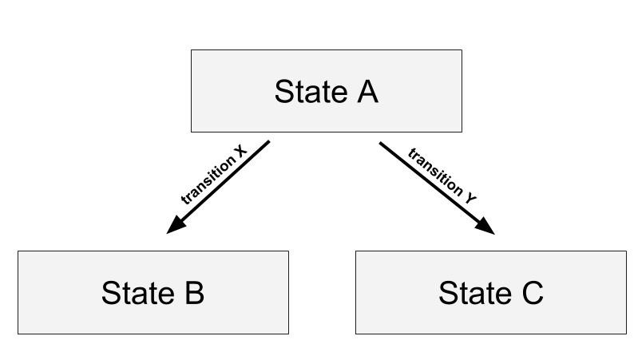

Here is a [demo](https://nicgirault.github.io/green) and the associated [source code](https://github.com/nicgirault/dynamic-transitions) of what is explained in this article.

## The problem

React-router and react-transition-group are two widely used librairies that can be combined to create transitions between routes.

However, in react-transition-group, once a component is mounted, its exit animation is specified, not changeable. Thus, dealing with transitions depending of the next state (what I call dynamic transitions) is challenging with this library.

<div className="Image__Medium">
  
</div>

_The exiting transition of state A does not depend only from state A ("dynamic transition")_

Although a [simple example](https://reacttraining.com/react-router/web/example/animated-transitions) is available on react-router doc, it is not easy to tweak it to create more sophisticated use cases such as dynamic transitions. In this article, I'll explain how to do so thanks to react-router v4 and react-transition-group v2.

## 1. Understanding the simple example

If you are on your way developing transitions between pages of your react app, you might have already met this code snippet from [react-router doc](https://reacttraining.com/react-router/web/example/animated-transitions) (adapted with state A/B):

```jsx
<TransitionGroup>
  <CSSTransition key={location.key} classNames="fade" timeout={300}>
    <Switch location={location}>
      <Route exact path="/state-a" component={A} />
      <Route exact path="/state-b" component={B} />
    </Switch>
  </CSSTransition>
</TransitionGroup>
```

Understanding why this piece of code allows a transition between two routes is not obvious. However, it is necessary to implement a more sophisticated use case such as dynamic transitions.

### About TransitionGroup

I will rephrase what is already written in this article: [a shallow dive into react router animated transitions](https://medium.com/@pshrmn/a-shallow-dive-into-react-router-v4-animated-transitions-4b73f634992a).

When transitioning from state A to state B, `location.key` value changes (let's say from `A` to `B`) so without a `<TransitionGroup>` wrapping `<CSSTransition key={location.key}>` , the `<CSSTransition key='A'>` would be unmounted and a new `<CSSTransition key='B'>` would be mounted (because react identifies elements thanks to key).

However, `<TransitionGroup>` tracks its children by key and when one of its children disappears, it keeps rendering it for the time of the transition. So during the time of the transition, the above TransitionGroup would render something similar to this:

```jsx
<div>
  <CSSTransition key="A" leaving>
    <Switch location={location}>
      <Route exact path="/state-a" component={A} />
      <Route exact path="/state-b" component={B} />
    </Switch>
  </CSSTransition>
  <CSSTransition key="B" entering>
    <Switch location={location}>
      <Route exact path="/state-a" component={A} />
      <Route exact path="/state-b" component={B} />
    </Switch>
  </CSSTransition>
</div>
```

### About Switch

You simply need to understand that when `location.pathname` is `/state-a`, this:

```jsx
<Switch>
  <Route exact path="/state-a" component={A} />
  <Route exact path="/state-b" component={B} />
</Switch>
```

it renders:

```jsx
<A />
```

### Why you need to pass a location prop to the switch?

By default, a switch uses `history.location` to select the route to render. However you can provide a location prop to the `switch` that will override the default `history.location` value:

```jsx
<TransitionGroup>
  <CSSTransition key={location.key} classNames="fade" timeout={300}>
    <Switch location={location}>
      <Route exact path="/state-a" component={A} />
      <Route exact path="/state-b" component={B} />
    </Switch>
  </CSSTransition>
</TransitionGroup>
```

So why this `location` (provided by `withRouter` or available within a route component) must be added as a prop to the switch in a transition use case? _(see the origin of this requirement, in [this issue](https://github.com/ReactTraining/react-router/issues/4351))_

`history.location` is a live object whereas the `location` provided by `withRouter` is immutable ([see doc](https://github.com/ReactTraining/react-router/blob/db597b2239ae4a501b637a35aac9fc6614cdb73a/packages/react-router/docs/api/location.md)). Thus, without providing a `location` prop to the switch, the switch would always match the route according to the **current** location (the location of `history.location`). So during the transition (the current location is `B`), the `<TransitionGroup>` would render:

```jsx
<div>
  <CSSTransition key="A" leaving>
    <B />
  </CSSTransition>
  <CSSTransition key="B" entering>
    <B />
  </CSSTransition>
</div>
```

However, if you pass a location to the switch, the switch will use this prop instead of `history.location` and since `location` is immutable, the previous `<CSSTransition>` received the previous `location` and the new `<CSSTransition>` receives the new `location`.

```jsx
<div>
  <CSSTransition key="A" leaving>
    <A />
  </CSSTransition>
  <CSSTransition key="B" entering>
    <B />
  </CSSTransition>
</div>
```

Thereby the leaving `<CSSTransition>` will still render an old route even if a new location has been pushed to the history.

## 2. Dealing with dynamic transitions

Dealing with dynamic transitions is not straight forward. [An issue](https://github.com/reactjs/react-transition-group/issues/182) on react-transition-group is open to consider this problem.

As explained in the issue:

> once a component is mounted, its exit animation is specified, not changeable.

Indeed, in this code snippet:

```jsx
<TransitionGroup>
  <CSSTransition key={location.key} classNames="fade" timeout={300}>
    <Switch location={location}>
      <Route exact path="/state-a" component={A} />
      <Route exact path="/state-b" component={B} />
    </Switch>
  </CSSTransition>
</TransitionGroup>
```

only the current (entering) child is accessible. The exiting one has already been removed. It is only living within the `<TransitionGroup>` state.

Fortunately the `<TransitionGroup>` component can receive a `childFactory`. The doc says:

> If you do need to update a child as it leaves you can provide a childFactory to wrap every child, even the ones that are leaving.

So the `childFactory` prop makes it possible to specify the leaving transition of a component after rendering it (and thus solves the problem of dynamic transitions)

```jsx
<TransitionGroup
  childFactory={child =>
    React.cloneElement(child, {
      classNames: "newTransition",
      timeout: newTimeout
    })
  }
>
  <CSSTransition key={location.key}>
    <Switch location={location}>
      <Route exact path="/state-a" component={A} />
      <Route exact path="/state-b" component={B} />
    </Switch>
  </CSSTransition>
</TransitionGroup>
```

In the above code snippet, the previous `<CSSTransition>` will be updated with the new transition class name and timeout.

### A possible implementation of dynamic transitions

The question is now: how do you give the right classNames value according to the state transition?

A possible solution is to use the **location state**.

About location state in the location doc:

> Normally you just use a string, but if you need to add some "location state" that will be available whenever the app returns to that specific location, you can use a location object instead. This is useful if you want to branch UI based on navigation history instead of just paths (like modals).

Here is how you could do:

```jsx
// state-a.js
export default props => (
  <div>
    <button
      onClick={() => {
        history.push({
          pathname: "/state-b",
          state: { transition: "fade", duration: 300 }
        });
      }}
    >
      Go to state B
    </button>
    <button
      onClick={() => {
        history.push({
          pathname: "/state-c",
          state: { transition: "slide", duration: 500 }
        });
      }}
    >
      Go to state C
    </button>
  </div>
);
```

In the routes definition file:

```jsx
<TransitionGroup
  childFactory={child =>
    React.cloneElement(child, {
      classNames: location.state.transition,
      timeout: location.state.duration
    })
  }
>
  <CSSTransition key={location.key}>
    <Switch location={location}>
      <Route exact path="/state-a" component={A} />
      <Route exact path="/state-b" component={B} />
    </Switch>
  </CSSTransition>
</TransitionGroup>
```

Now you should get 2 different transitions from the same exiting state 🎉🎉🎉. This is what we were trying to solve :-).

Demo + source code
[Demo](https://nicgirault.github.io/green) + [source code](https://github.com/nicgirault/dynamic-transitions)

## Annexe A: Wrap your pages in a div

You should wrap your switch in a div until [this issue](https://github.com/reactjs/react-transition-group/issues/208) is solved:

```jsx
<CSSTransition>
  <div>
    <Switch>...</Switch>
  </div>
</CSSTransition>
```

Otherwise you'll get an uncaught error if any of the route you define renders `null`.

## Annexe B: CSSTransition and styled-components

As CSS-in-JS is now a standard in react development, you might be looking for a solution to handle `<CSSTransition>` with CSS-in-JS. Here is my solution:

```jsx
// fade.js
import { injectGlobal } from "styled-components";
const transitionClassName = "fade";
const duration = 400;
injectGlobal`
.${transitionClassName}-enter {
  opacity: 0;
}
.${transitionClassName}-enter.${transitionClassName}-enter-active {
  opacity: 1;
  transition: all ${duration}ms;
}
.${transitionClassName}-exit {
  opacity: 1;
}
.${transitionClassName}-exit.${transitionClassName}-exit-active {
  opacity: 0;
  transition: all ${duration}ms;
}
`;
export default { transition: transitionClassName, duration };
```
