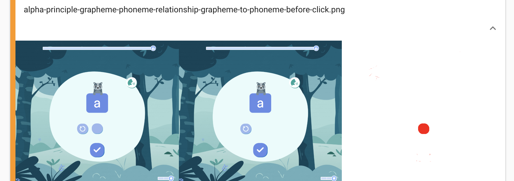

# Capturing visuals bugs before they reach production

At [Lalilo](https://www.lalilo.com?utm_medium=blog&utm_source=medium&utm_campaign=article_by_dev), we try to reuse *React* components throughout the apps which means a Button might be used a dozen times on different pages.The style of our components are layered, which means the style for a given button might be defined in Button, then in BigButton and finally in BigBlueButton.

*BigBlueButtons are great*

When Dave updated BigButton to display the text as uppercase as required, Dave messed up all of theBigBlueButtons without noticing. Dave asked for his code to be reviewed and pushed to a staging environment. Dave proudly showed the style update to the dev team which validated and proceeded to deploy the new button to production. Tests on the CI were green, of course.

Later that day, Bob looks at the teacher dashboard in horror. Why the hell is the *Login *button uppercased? He’s sure Dave messed up once again!

The few tests the front end previously had didn’t prevent the team from pushing visual regressions to production. The team needed a tool to do just that: testing every code update for visual regression. That would mean taking screenshots of a lot of elements and comparing them with the stable version. Whenever there’s a difference the team should be alerted.

## Let’s get started!

We need to isolate components to test them as units with all their different states. So we export and display them on a route to take screenshots.

```tsx
import React from 'react'

import { Key } from '.'

const testCases = [
  { status: 'DISABLED' },
  { status: 'SELECTABLE' },
  { status: 'SUBMITTED' },
  { status: 'SELECTED' },
  { status: 'USED' },
]

const Keys = () => (
  <div className="testCase">
    {testCases.map(({ status }, index) => (
      <Key
        key={index}
        status={status}
      >
        a
      </Key>
    ))}
  <div/>
)

Keys.displayName = 'Keys'

export default Keys
```

*Smile! 📸*

We then take screenshots with testcafe. [Testcafe](https://devexpress.github.io/testcafe/) is an incredibly powerful tool to automate end to end tests (more on that in another article). Taking screenshots for each component is a matter of a few lines:

```tsx
import { Selector } from 'testcafe'

import { baseUrl, config } from '../src/rendered-tests/server'

// We are rendering the page that contains all our component tests
fixture(`Components`).page(`${baseUrl}#/visual-tests`)

test('Components are well rendered', async t => {
  // All component tests have the 'testCase' class
  const testCases = Selector('.testCase')
  const count = await testCases.count

  for (let i = 0; i < count; i++)
    await t.takeElementScreenshot(testCases.nth(i))
})
```

We run the tests every time we integrate changes on staging or production. Which means setting up the tests on our continuous integration platform (we use CircleCI) and preventing merges when changes are detected. We build the app, serve it to render components and take screenshots during our CI process.

To do that we use [Argos](http://argos-ci.com), a SaaS comparing screenshots that is hooked to Github. When using CircleCi, the command to upload screenshots to Argos is:

    argos upload screenshots --token $ARGOS_TOKEN --commit $CIRCLE_SHA1 --branch $CIRCLE_BRANCH

*Note: You can get your ARGOS_TOKEN from the Argos webapp when going in your project’s settings.*

Argos is then plugged into our CircleCi project so that every time we open a pull request we have a status telling us wether differences were found in screenshots or not:


By clicking on details, we’re provided with all the screenshots we sent and their difference with the main branch. Here is an example with the capture from staging on the left, the capture from the pull request in the middle and the diff on the right:


Dave got close to pushing regression but was caught by the system!

## We’re not done yet

Now that Dave discovered screenshot testing, he became kind of addicted to that. He added screenshots on all of the UI components, and thanks to the power of testcafe, he now also takes full app screenshots to keep an eye on components integrations.



### Build times

As testcafe allows to interact with the app the same way a real user would, we can take screenshots not only from the `screenshots` route but also from all parts of the application users can access.

However, this takes time, as we ask testcafe to wait for all animations to finish and elements to appear before clicking on UI elements. This results in CircleCI builds now being way longer than before.

Like a lot of developers, Dave doesn’t like long builds. To avoid them we found two solutions:

* Use testcafe’s concurrency: testcafe allows to run tests as concurrent tasks (see the [documentation](https://devexpress.github.io/testcafe/documentation/using-testcafe/common-concepts/concurrent-test-execution.html)). Setting the concurrency value to 5 for example allows to run 5 tests at the same time, which makes the total build time smaller.

* Use CircleCI’s workflows: CircleCI workflows allow to run different jobs relative to one build at the same time. It can be used to run end to end screenshots tests while other tests are running, instead of having to wait for them to end. It results in a total build time improvement. However, this is not very effective if only two jobs are run at the same time, as switching from normal jobs to workflows introduces some context saving time to the build.

Also, Dave noticed Argos statuses were often red. After some investigations, we found three distinct causes for that.

### Animations

Animations really lower automatic screenshots comparison reliability. We will never take screenshots at exactly the same frame, creating artificial differences that have to be checked manually.


For now, we found no perfect solution to avoid that. We added a delay before taking each screenshot to make sure animations are finished. However, doing that makes the build even slower. Another solution could be to have a debug mode deactivating every animation in the app. Such a solution would solve the problem once and for all but might be quite difficult to implement.

### Randomness

Also, our app has a lot of randomly generated content. This also results in artificial differences that have to be checked manually.


Making these values deterministic during end to end tests solves this, but the work required to do so will vary a lot according to the app. If randomness comes from API results, testcafe makes it possible to mock the API.

### Image rendering diffs

Finally, Argos image comparison algorithm is very strict. It sometimes results in a few pixels variation on a screenshot triggering a failed Argos comparison.

*See those small red dots on the right?*

This is a behaviour that may be wanted on some apps, but that creates unexpected differences when working with vector images.

We have found no proper way to handle this issue yet. We started doing some tests with the CSS shape-rendering property to have a better control over aliasing, but if you have any other suggestions, feel free to add them in the comments!

## A world of possibilities

These minor issues aside, Dave still enjoys these screenshot tests and could not code without them anymore. They saved him and his team from so many visual regressions that he can’t stop thinking of new ways to use them:

* Screenshot and end to end testing on different browsers and browser versions to check compatibility and design breaks

* Screenshots on different viewports for responsiveness

* Using a cloud mobile devices provider like BrowserStack to test mobile and tablet behaviours.

On the road to making a great product, Dave found out automatic visual testing to be a very good ally.
